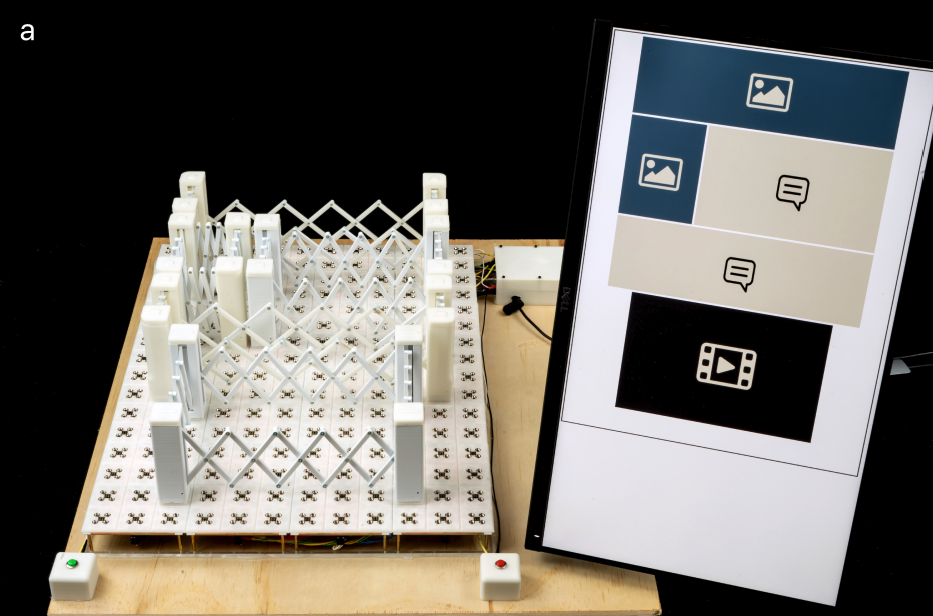

# TangibleGrid and Accessibility

  
  

## But what is "Accessibility"?

You design things to be "accessible" primarily to be usable by disabled people and to reduce barriers (Microsoft, n.d.). This can be both direct, for example writing in very large letters that can be seen easily by people who can't see well and indirect. Indirect here means that whatever you are designing is compatible with the person's assistive technology. A common example you might have seen before (indicated by a symbol) are audio induction loops which can connect to hearing aids to transmit sound. These can be found in places such as trains or universities.

Something you might have noticed is that I said primarily at the start of this section. Even if you might not be or feel disabled, accessibility can still greatly benefit you. There are a lot of situations where you might be impaired in certain ways. If you are not disabled in any way but are pushing a bike for example, going up stairs becomes really hard and you might appreciate a ramp which is also used by people who use wheelchairs.

  

## Interacting with a computer you can't see

Now that we've established what accessibility means, I want you, the reader, to try something yourself. I assume you are already sitting at a computer or laptop (though phone works too). Close your eyes, open the first book on Project Gutenberg and read the first paragraph of the first book that appears. If you struggle, open your eyes again and switch back to this blog post. You might find this exercise very hard. Luckily for blind people (and you in this situation) however, there are ways to solve this such as with screen readers (American Foundation for the Blind, n.d.).

These are programs that read text displayed on the screen and spell it out to the user using text-to-speech or a braille display. If, for example, you were a software developer, this might be very handy as you could have code be read out to you. But what if you had to design a website? Screen readers can't exactly spell out where elements are located so this poses a problem. Now there are ways to make graphics more tactile such as printing with swell paper (American Thermoform, n.d.) but this is not real-time and takes quite a lot of time which is annoying and slow as each single edit would need a new sheet. A different current approach uses projected light (Linnander et al., 2025) but this technology is rather new. It seems promising though. Yet another approach uses a multi-modal system using a touchscreen but the big issue here is that there are no tactile markers to orient yourself around. You're just sliding around your finger on the flat glass of an iPad (Potluri et al., 2019).

  
  

## An introduction to TangibleGrid

TangibleGrid aims to solve that problem (Li et al., 2022). It's kind of like building a website with physical Lego bricks except instead of bricks you place down fences. The system detects the location using a key switch matrix circuit. Each bracket has specific resistors in its corners that connect via pogo pins, allowing the board to distinguish the bracket type based on resistance values. It also both gives audio feedback on the location and updates the HTML on the connected computer screen. The brackets themselves have tactile patterns on top so that the user can distinguish between the content type (text, video, image) and are connected with a scissored linking mechanism. The cool part about this type of linking is that it makes it much easier to feel the shape and size of an element.

The brackets are put onto a physical baseboard that represents the web layout canvas with 12 columns and 16 rows and comes with magnetic grids and sensors.

  

  

## Of studies and their results

The researchers tested TangibleGrid with 10 blind participants (six totally blind, four legally blind) through two tasks: understanding an existing layout and designing one from scratch.

In task one, participants explored a pre-made layout with audio turned off, relying purely on touch. Everyone successfully identified the types, sizes, and positions of four brackets. The scissored linkage was very important as users would find one corner and trace along the structure to map out each bracket's full shape. It's a very similar principle as if you were to close your eyes and trace your fingers around an object. You can still imagine how the object's shape looks like without seeing it.

Task two was harder and involved creating a specific layout based on verbal descriptions. Yet again, everyone succeeded, even those with zero web design experience. Two different placement strategies emerged, leading to split opinions on the magnetic snapping feature. Participants who liked to adjust size while the bracket was snapped to the board loved the stability, while those who tried to adjust the size in mid-air found the magnets fought against them when they tried to place it down.

One can definitely say that TangibleGrid works. Through both tasks, blind users could independently understand web layouts, something which is much harder to do without sighted assistance.

  

## What lies beyond websites

  

TangibleGrid's approach using tangible brackets for visual elements, similar to Molder (Shi et al., 2020), extends to other block-based design tools. PowerPoint presentations, UI design software, and data visualization tools all depend on arranging elements spatially. I used PyQt a lot during my bachelor thesis and kept wishing I could physically move UI elements around instead of switching back and forth between code and preview windows. For blind users, this would be a lot more important, as it would make spatial design possible without relying entirely on screen readers and similar technology. This could open professional opportunities in UI development and design work that currently requires sight.

  
  

## Back to (talking about) the future

Although TangibleGrid works well for what it is, there are still quite a few large limitations. You might have noticed that I've never talked about how you can actually put content into the layout you created with TangibleGrid. This is because the device does not currently support content input or any further customization at all. This is a huge issue as if you design the layout of a website, you probably also want to work with it more than that. Another issue is that the layout is not adaptive to browser size and only has the layout of the board. On an ultrawide monitor like the one I'm sitting at right now, the vertical layout the board is stuck to would look quite bad for example. A final issue is that users might prefer different magnet strengths for individual reasons but the current design does not support adjusting that.

However, both of these issues can be fixed. To fix content input, one could add an input device such as a braille keyboard or something similar. Maybe even a device dedicated for shortcuts such as an Elgato Stream Deck? On the other hand, other physical modifications would need to be made to fix the size adaption and the magnet strength. The authors actually have some really cool ideas for that involving hardware solutions like electromagnets to adjust the snapping strength or making the baseboard modular so that users can stick together "bricks" of boards similar to Lego.
To go even further, it could be a very good idea to develop an AI integration similar to Gemini Live. Imagine a blind user being able to speak to the board and the LLM generates the content to fit the constraints of the physical bracket.
  

## Conclusion

Overall, TangibleGrid can't yet fully support independent website design and is restricted to layouts. However, it and similar innovations such as shapeCAD (Siu et al., 2019) are proof that physical interfaces can make visual tasks more accessible. By making website layouts tangible, TangibleGrid makes web design and potentially even more tasks that currently require sight possible. That's worth building on.

  

---

  

## References

  

American Foundation for the Blind. (n.d.). *Screen readers*. https://afb.org/blindness-and-low-vision/using-technology/assistive-technology-products/screen-readers

  

American Thermoform. (n.d.). *Swell touch paper*. https://americanthermoform.com/product/swell-touch-paper/

  

Li, J., Yan, Z., Jarjue, E., Shetty, A., & Peng, H. (2022). TangibleGrid: Tangible web layout design for blind users. *Proceedings of the 35th Annual ACM Symposium on User Interface Software and Technology (UIST '22)*, 1–12. https://doi.org/10.1145/3526113.3545627

  

Linnander, M., Goetz, D., Reardon, G., Kumar, V., Hawkes, E., & Visell, Y. (2025). Tactile displays driven by projected light. *Science Robotics, 10*. https://doi.org/10.1126/scirobotics.adv1383

  

Microsoft. (n.d.). *Inclusive design principles*. https://inclusive.microsoft.design/#InclusiveDesignPrinciples

  

Potluri, V., He, L., Chen, C., Froehlich, J. E., & Mankoff, J. (2019). A multi-modal approach for blind and visually impaired developers to edit webpage designs. *The 21st International ACM SIGACCESS Conference on Computers and Accessibility (ASSETS '19)*, 612–614. https://doi.org/10.1145/3308561.3354626

  

Shi, L., Zhao, Y., Gonzalez Penuela, R., Kupferstein, E., & Azenkot, S. (2020). Molder: An accessible design tool for tactile maps. *Proceedings of the 2020 CHI Conference on Human Factors in Computing Systems (CHI '20)*, 1–14. https://doi.org/10.1145/3313831.3376431

  

Siu, A. F., Kim, S., Miele, J. A., & Follmer, S. (2019). shapeCAD: An accessible 3D modelling workflow for the blind and visually-impaired via 2.5D shape displays. *The 21st International ACM SIGACCESS Conference on Computers and Accessibility (ASSETS '19)*, 342–354. https://doi.org/10.1145/3308561.3353782

  

---

  

# About the author

I'm Jan Blum, a hard of hearing CS student at ETH Zurich. If I'm not studying, I'm usually found playing card games or Pathfinder.