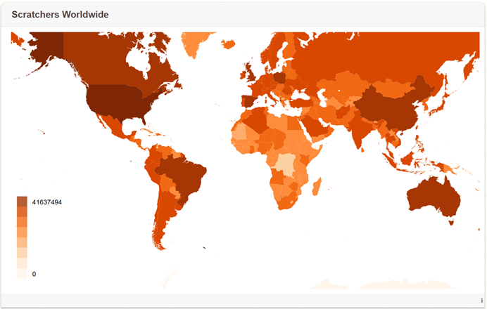
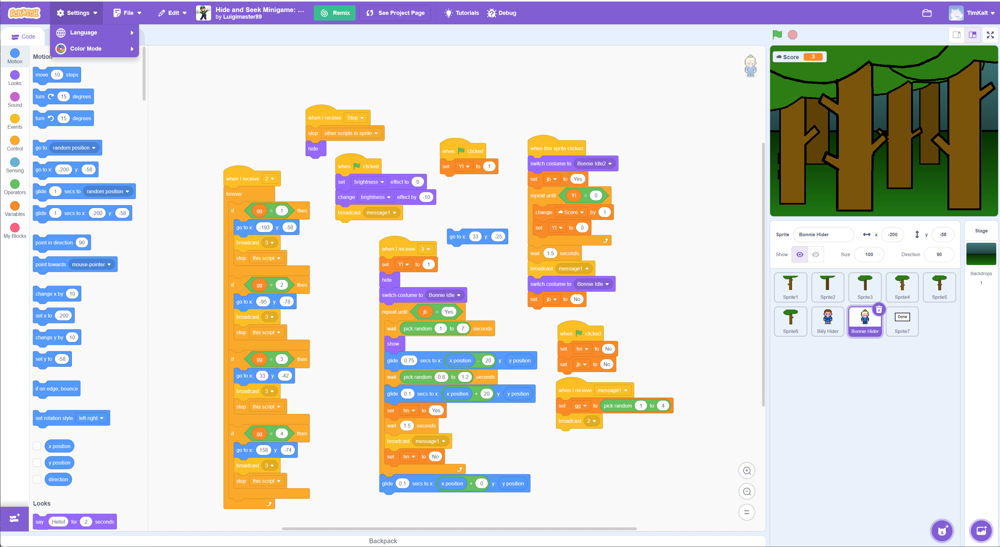
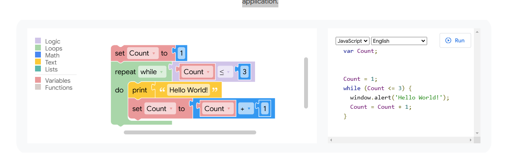
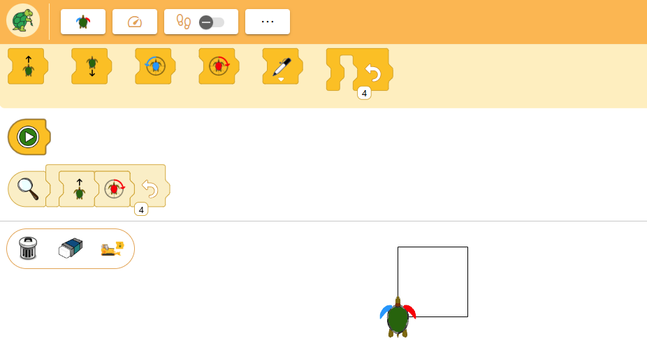

# Scratch: Programming for All

For decades, learning to program meant wrestling with syntax errors, cryptic compiler messages, and abstract problems far removed from everyday experience. For many learners, especially children, this could be very discouraging. In 2007, the MIT Media Lab released Scratch, a visual programming environment designed to make programming feel more like playing, creating, and sharing.

Two years later, Resnick et al.’s article “Scratch: Programming for All” (2009) laid out this vision. They argued that programming shouldn’t be reserved just for future software engineers, but could become a new way for people to tinker, express themselves, and interact socially.

More than fifteen years later, millions of learners around the world use Scratch. It builds on earlier attempts like Logo, while projects like Blockly, developed around the same time, lack the social aspects that Scratch emphasizes.

    

    <a href="https://scratch.mit.edu/statistics" target="_blank">MIT Scratch Statistics</a>

---
## Why Scratch?

Traditional programming languages are built for professionals. They require precision before creativity and correctness before exploration. For beginners, especially children, this often leads to frustration before understanding.

Scratch was designed to flip that experience. Drawing on constructionist learning theory, it encourages learners to create games, animations and interactive stories that matter to them personally. Programming becomes a *means of expression*, not just an abstract exercise (Resnick et al., 2009).

This idea is still relevant today. As computational thinking becomes a core educational goal, the question isn’t whether people should learn programming, but how we can design interfaces that welcome everyone, not just those drawn to text-based coding.

---
## How Scratch Works: Expressiveness Through Constraints

Scratch replaces text-based syntax with blocks. This simple change removes many types of errors: blocks only snap together in ways that make sense. Learners can concentrate on logic and behavior instead of worrying about grammar.

Scratch programs respond to events like key presses, mouse clicks, or messages from other parts of the program. This mirrors real-world interactive systems, GUIs, and simulations, while staying intuitive for beginners. Concurrency happens naturally, as multiple blocks run at the same time without needing explicit instructions.

The blocks in Scratch are surprisingly powerful. They include variables, lists, loops, conditionals, and even advanced blocks up to third-party AI integration <a href="https://machinelearningforkids.co.uk" target="_blank">AI integration</a>. Maloney et al. (2010) describe this as offering a low floor, wide walls, and high ceiling: easy to start, flexible in what you can build, and capable of supporting complex ideas.

    

    <a href="https://scratch.mit.edu/projects/1182167528/editor/" target="_blank">Hide and Seek Minigame: Round 1</a>

---
## Programming as a Social Practice

One of Scratch’s most important contributions is its focus on community. The online platform allows users to share projects, view each other’s code, and remix work collaboratively.

Resnick et al. (2009) frame remixing not as cheating, but as a way to learn. By studying and modifying others’ projects, learners discover new techniques and ideas. Analyses show that remixing plays a key role in creativity, learning progress, and engagement (Vourletsis et al., 2022).

This approach transforms programming from a solitary activity into a shared, cultural practice.

---
## Scratch Today: Extensions, Curriculum, and Research

Scratch has grown a lot since 2009. Scratch 3.0 introduced a modern web-based architecture and an extension system that integrates hardware like micro:bit, LEGO robotics, and sensors.

Research on Scratch shows that block-based environments can expand without losing accessibility. Dasgupta et al. (2015) highlight how extensions create *new pathways into programming*, connecting code to real-world contexts and domain-specific concepts.

Recent curriculum efforts, like the Creative Computing Curriculum Guide: <a href="https://scratched.gse.harvard.edu/guide/curriculum.html" target="_blank">Creative Computing Curriculum Guide</a>, emphasize exploration, reflection, and collaboration instead of rigid instruction.

---
## Blockly: The Engine Beneath the Blocks

Scratch is a complete programming environment, while Blockly serves a different purpose. Created by Google, Blockly is an open-source library for building block-based editors. It handles dragging, snapping, and validation, while leaving runtime behavior to the host application.

Scratch started independently of Blockly, but Scratch 3.0 now uses Blockly. This allowed Scratch to modernize the editor while keeping its familiar block-based interaction model (Pasternak, 2019).

Blockly’s flexibility has made it the backbone for many educational tools, including Blockly Games, Code.org, and App Inventor.

In the Scratch ecosystem, Blockly provides the infrastructure, while Scratch offers the pedagogical vision.

    

    <a href="https://developers.google.com/blockly#build-with-blockly" target="_blank">Developer Google Blockly</a>

---
## (X)Logo: A Historical and Pedagogical Ancestor

Long before Scratch or Blockly, there was Logo. Developed in the late 1960s by Seymour Papert, Logo let learners explore math and computing through turtle graphics—moving a turtle that draws shapes on the screen.

XLogo is a modern open-source version, with <a href="https://xlogo.inf.ethz.ch" target="_blank">XLogoOnline</a> maintained by ETH Zurich as a web-based learning environment. Unlike Scratch, XLogo uses textual commands, bridging the gap between visual and text-based programming.

Recent studies on XLogoOnline (e.g., Wen et al., 2024) show that even minimalist environments foster innovation, including automated task generation and adaptive learning support. Pedagogically, XLogo shares Scratch’s constructionist roots but differs in interface choices and community features.

Scratch can be seen as a descendant of Logo: where Logo focused on thinking through motion and geometry, Scratch extends those ideas into animation, storytelling, and social sharing at scale.

    

    <a href="https://xlogo.inf.ethz.ch/release/latest/#/mini" target="_blank">ETH Zurich XLogo</a>

---
## Looking Forward: The Future of Block-Based Programming

Scratch’s influence reaches far beyond its own platform. Alongside Blockly and XLogo, it raises questions about the future of programming interfaces.

- **AI-assisted learning**: New systems are exploring Scratch-like environments with AI feedback that guides learners without limiting creativity.
- **Bridging to text**: Blockly’s code generation and XLogo’s textual commands suggest ways to ease the transition from beginner to advanced tools.
- **Inclusion and accessibility**: Scratch’s multilingual, remix-friendly community shows how programming tools can scale globally.

If programming is a new form of literacy, Scratch demonstrates that interfaces shape not just what people learn, but who gets to learn.

---
## Conclusion

“Programming for all” is an ambitious goal. Scratch doesn’t fully achieve it, but it comes closer than most systems. By combining thoughtful design, constructionist pedagogy, and a global community, Scratch has reshaped how millions first encounter computing.

Alongside Blockly and XLogo, Scratch stands out as a strong example that programming can be creative, social, and deeply human.

---
## References

Resnick, M., Maloney, J., Monroy-Hernández, A., Rusk, N., Eastmond, E., Brennan, K., ... & Kafai, Y. (2009). *Scratch: Programming for all*. **Communications of the ACM, 52**(11), 60–67. [https://doi.org/10.1145/1592761.1592779](https://doi.org/10.1145/1592761.1592779)

Maloney, J., Resnick, M., Rusk, N., Silverman, B., & Eastmond, E. (2010). *The Scratch programming language and environment*. **ACM Transactions on Computing Education, 10**(4), Article 16. [https://doi.org/10.1145/1868358.1868363](https://doi.org/10.1145/1868358.1868363)

Dasgupta, S., Clements, S. M., & Resnick, M. (2015). *Extending Scratch: New pathways into programming*. MIT Media Lab. [https://ieeexplore.ieee.org/document/7357212](https://ieeexplore.ieee.org/document/7357212)

Pasternak, E. (2019). *Scratch 3.0’s new programming blocks, built on Blockly*. Google Developers Blog. [https://developers.googleblog.com/scratch-30s-new-programming-blocks-built-on-blockly](https://developers.googleblog.com/scratch-30s-new-programming-blocks-built-on-blockly)

Vourletsis, I., & Politis, P. (2022). *Exploring the effect of remixing stories and games on the development of students’ computational thinking*. **Computers and Education Open, 3**, 100069. [https://doi.org/10.1016/j.caeo.2021.100069](https://doi.org/10.1016/j.caeo.2021.100069)

Wen, C., Ghosh, A., & Singla, A. (2024). *Task synthesis for elementary visual programming in XLogoOnline environment*.  [https://link.springer.com/chapter/10.1007/978-3-031-64312-5_37](https://link.springer.com/chapter/10.1007/978-3-031-64312-5_37)

---

<b>Tim Kaltenbrunner</b> is a senior software developer and software architect with over 15 years of experience driving enterprise automation across complex projects, primarily in the financial sector. He specializes in Java, Spring, cloud-native architectures, and DevOps, and regularly contributes as a Product Owner, or technical project lead. Tim holds an MSc in Computer Science from TU Munich and combines strong technical depth with a passion for solving challenging problems.

