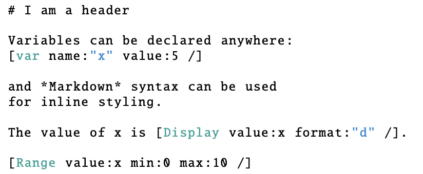

# Interactive Articles

**When reading turns into exploration and exploration turns into understanding**

Society started with storytelling. Then came paintings, then mass-printable text. Today we publish on a web that is effectively *infinitely* and *instantaneously* copyable. Accessibility is no longer the core bottleneck. Attention is. As low-signal content (AI slop) grows and our attention shrinks, we need formats that help us digest and *understand* information more deeply and more quickly.

Consider the difference between a description of bubble sort and an animation that shows each swap. Both can teach, but together they teach better, because the learner can connect explanation (“why”) to behavior (“what happens”) in real time.

## **What is an interactive article?**

An interactive article is not “a blog post with a chart.” It is a document where:

* **Narrative** guides the reader and explains what to look for in the interactive components.
* **Interactive elements** let the reader explore a visualization, data, parameters, and functions, rather than only observing a single static view.
* **A state model** keeps everything consistent. Changing one parameter updates the outcome in a way that depends on all the other parameters.

A fitting mental model is a debugger. 

A static article tells you *what happened*, an interactive article lets you step in, change inputs, and observe *what happens under variation*.

This matters especially in computer science. Many CS concepts are fundamentally about behavior across cases, performance under different distributions, failure modes, trade-offs, edge cases. Static images can show one slice but cannot show the landscape.

## **Why interactive articles are hard to do well**

High-quality interactivity is currently expensive. 

With static writing, you mesh an argument and its figures. With interactive writing, you coordinate narrative, visualization, state, and code, all while ensuring the experience remains coherent. Concretely this means:

* designing interaction that teaches rather than distracts
* handling state and dependency management
* learning unfamiliar tools and ecosystems
* dealing with packaging, deployment, and long-term maintenance

This overhead can make an article high-quality and high-signal but the cost is most likely double in each way.

## **Tooling that tried to reduce the overhead**

An attempt to reduce overhead is **Idyll**, which uses Markdown as the default authoring surface while supporting reactive components for interactivity. Conlen & Heer describe the central idea as treating interactivity as part of the document’s structure rather than an afterthought (Conlen & Heer, 2018).

In principle, this lets authors write normally and “drop in” sliders and components without building a brand new web app.

So why didn’t this style become mainstream?

After Jeffrey Heer helped release Idyll he also tried to launch Distill, a publication that pushed interactive, explorable ML communication. The work required to do research *and* write *and* build a robust interactive article is substantial (Hohman et al., 2020). For me the time effort was around 3-4 hours to understand the layout and how to navigate and possibilities and then another 2-3 hours for just designing components. Developping more complex ML tasks and making them intuitive is a lot more work and not surprisingly led to a lot of burnouts.

Interactive pieces in research also introduce frictions:

* **Maintenance:** reactive components break as dependencies/packages evolve
* **Archiving:** PDFs are stable, code-driven documents are hard to preserve
* **Data constraints:** large real-world datasets may be too large and too expensive to host for indefinite time

Interactive articles are often most feasible when explaining algorithms, conceptual models, or carefully curated datasets, cases where the “state space” is meaningful but still small enough to run smoothly. Yet distill went into hiatus in 2021 after most volunteers couldn't keep up with the workload introduced.

## **Where interactive articles are going**

As AI Slop is increasing and the world needs more trustworthy high-signal news and information I can see that interactive articles are one way to go. LLMs can help with the code generation for the visualisations and more focus can be applied to the content and teaching the new concepts rather than writing and coding. As the research community continues to use more LLMs to rewrite and generate content it will be good to have more trust in the work done. As writing code and text is no longer an indicator for quality but understandability, visualisations and explanations are. There will be a new demand for visualisations.

A slightly more recent direction in research is **explorable multiverse analysis**. Dragicevic et al. argue that many empirical results depend on a chain of reasonable analysis choices, filtering rules, model forms, covariates, thresholds. Traditional papers compress those forks into a single narrative path. The multiverse approach turns the paper into an interface where readers can explore how conclusions change across the space of choices (Dragicevic et al., 2019).

Tooling is also moving in this direction. For example, **Living Papers** (Same authors as Idyll) proposes language/tooling support for “augmented scholarly communication” rather than one-off interactive builds (Heer et al., 2023). More recent work explores human–AI co-exploration for crafting research narratives (Zhang et al., 2025).

The remaining blocker is still incentives and effort. Asking a PhD student to spend an additional one to two weeks to build and maintain a polished interactive layer is often unrealistic. The optimistic bet is that AI-assisted coding and better component ecosystems will reduce that marginal cost, making it easier to prototype interactive elements quickly, validate correctness visually, and publish without bespoke engineering.

Meanwhile, newsrooms have shown that reusable interactive components can scale. Outlets such as *The New York Times* routinely use interactive maps and region-based interfaces for elections and civic information, interfaces that are repeatable across stories rather than handcrafted each time.

If this trend continues, the “next web format” may be less about infinite publishing and more about *structured exploration*: narrative that helps you ask the right questions, plus interfaces that let you test them.

## **Short bio**

**Dominique Buob** is a computer science student focus on making complex data understandable, getting insights and acting on new knowledge gained.

## **References**

Conlen, M., & Heer, J. (2018). Idyll: A markup language for authoring and publishing interactive articles on the web. In *Proceedings of the 31st Annual ACM Symposium on User Interface Software and Technology (UIST ’18)*. [https://doi.org/10.1145/3242587.3242600]

Dragicevic, P., Jansen, Y., Sarma, A., Kay, M., & Chevalier, F. (2019). Increasing the transparency of research papers with explorable multiverse analyses. In *Proceedings of the 2019 CHI Conference on Human Factors in Computing Systems (CHI ’19)* (pp. 1–15). [https://doi.org/10.1145/3290605.3300295]

Heer, J., Conlen, M., Devireddy, V., Nguyen, T., & Horowitz, J. (2023). Living Papers: A language toolkit for augmented scholarly communication. In *Proceedings of the 36th Annual ACM Symposium on User Interface Software and Technology (UIST ’23)*. [https://doi.org/10.1145/3586183.3606791]

Hohman, F., Conlen, M., Heer, J., & Chau, D. H. P. (2020). Communicating with interactive articles. *Distill, 5*(9). [https://doi.org/10.23915/distill.00028]

Zhang, R., Ouyang, Y., Shen, L., Tang, Y., Ma, X., Qu, H., & Xu, X. (2025). PaperBridge: Crafting research narratives through human–AI co-exploration. In *Proceedings of the 38th Annual ACM Symposium on User Interface Software and Technology (UIST ’25)*. [https://doi.org/10.1145/3746059.3747713]

Chen, Z., & Xia, H. (2022, April). *CrossData: Leveraging text-data connections for authoring data documents*. In *Proceedings of the 2022 CHI Conference on Human Factors in Computing Systems* (pp. 1–15). [https://hci.ucsd.edu/papers/crossdata.pdf]